**Foster Family** is a desktop app built for the **foster managers of cat and dog shelters** to help them perform **foster family management tasks**. 

Some tasks Foster Family can help you with: 
* **Store and update** the important details of animal fosterers
* Search for a fosterer using _**any**_ detail you can remember of them
* **Gain insights** on the current status of fosterers

Foster Family is **optimised for use** via a Command Line Interface (CLI). This means you interact with it by typing commands in the command box. It also retains the benefits of a Graphical User Interface (GUI), allowing you to interact with the application through graphical components. If you can type fast, Foster Family can get things done faster than traditional GUI apps.

This user guide contains **all** the commands available to you, along with **step-by-step explanations** and **examples** to help you master the use of Foster Family. If you are a _new user_, simply head over to [Quick Start](#quick-start) to begin your journey with us. For those who are _already acquainted_, you can refer to the [Table of Contents](#table-of-contents) below to navigate to your command of interest.

## Table of Contents
* Table of Contents
{:toc}

--------------------------------------------------------------------------------------------------------------------

## Quick Start
1. Ensure you have Java `11` or above installed in your computer. You can download it from [here](https://www.oracle.com/sg/java/technologies/javase/jdk11-archive-downloads.html).

2. Download the latest `FosterFamily.jar` from [here](https://github.com/AY2324S1-CS2103T-T13-4/tp/releases).

3. Copy the file to the folder you want to use as the _home folder_ for Foster Family.

4. Open a command terminal.
5. Navigate to the home folder you put the jar file in using the command `cd <path_to_home_folder>`, replacing `<path_to_home_folder>`  with your file path. 
6. Use the `java -jar FosterFamily.jar` command to run the application. 
   The Foster Family GUI should appear on screen, similar to the screenshot attached below. Note how the app contains some sample data. 
   

7. Type a command in the command box and press Enter to execute it. e.g. typing `help` and pressing Enter will open the help window. 
   Some example commands you can try:

* `list` : Lists all fosterers.

* `add n/Jerry Tan p/98765412 e/jerry123@example.com a/61 Baker Street housing/nil availability/nil animal/nil animalType/nil` : Adds a fosterer named `Jerry Tan` to Foster Family.

* `delete 3` : Deletes the 3rd fosterer shown in the current list.

* `reset`, followed by `reset confirm` : Deletes all fosterers.

* `exit` : Exits the app.

8. Refer to the [Features](#features) section for details of each command.

--------------------------------------------------------------------------------------------------------------------
## Useful Notations
These are symbols we will be using to highlight certain information to you.

| Symbol               | Meaning                                                                          |
|----------------------|----------------------------------------------------------------------------------|
| :information_source: | General notes about command                                                      |
| :exclamation:        | Important notes about command                                                    |
| :warning:            | Warnings about command, where action may lead to data loss or  misinterpretation |
| :bulb:               | Tips to optimise the use of Foster Family                                        |

--------------------------------------------------------------------------------------------------------------------
## User Interface (UI)

These are the two different screens you will be interacting with in Foster Family. 

### The Main Window 

This is the main view that welcomes you when you first open up Foster Family.

 

### The Profile Page 

This is the profile view that you can use to add a fosterer or edit an existing fosterer. 

 

#### How to open profile

There are 2 ways you can use to open this profile page. 
1. Enter <code>add</code> to view an _empty_ profile page to [add](#adding-a-fosterer-through-the-profile-page-add) a fosterer.
2. Enter either <code>edit INDEX</code> or <code>view INDEX</code> to [edit](#editing-a-fosterers-detail-through-the-profile-page-edit) or [view](#viewing-a-fosterers-detail-view) the fosterer at index <code>INDEX</code> in Foster Family.

Let's say you want to open a profile of a fosterer name Benson Meie who is currently on index 1. 

 

Enter <code>view 1</code> like the example above, which opens the profile page of the fosterer at index 1, Benson Meie. 

 

 

#### Navigating through fields

Typing in the name of the field you want to edit, or substrings of the field, directs your cursor to the textbox, allowing you to make changes.

 

In the example above, entering <code>name</code>, or a substring of name like <code>nam</code> brings the focus to the name field.

 

 

After you are done editing, pressing the Enter key brings your cursor back to the command box with your new changes intact.  
If you want to revert back to the original value of the field while editing on the textbox, press the Esc key to cancel the changes and bring your cursor back to the command box. 

 

In the example above, after changing name from 'Meie' to 'Mei' the Enter key was pressed. 

The same process can be applied to other fields.

 

#### Saving changes

Entering <code>save</code> saves the changes you made into the storage.

Let's say after changing the name, you want to save your changes.

 

Key in <code>save</code> and press Enter to save the changes. 

 

This saves the changes you made and updates the details of a fosterer, or adds a new fosterer with the input details (depending on the command used to open the profile page). 

 

#### Exiting the profile page

Entering <code>exit</code> closes the profile page and leads you back to the main window.
Attempting to exit without saving your changes will give you a warning message, advising you to save your changes. 

 

**1. Changes are saved**

Let's say you have already saved your changes.

 

Type in <code>exit</code> and press Enter to close the profile page.

 

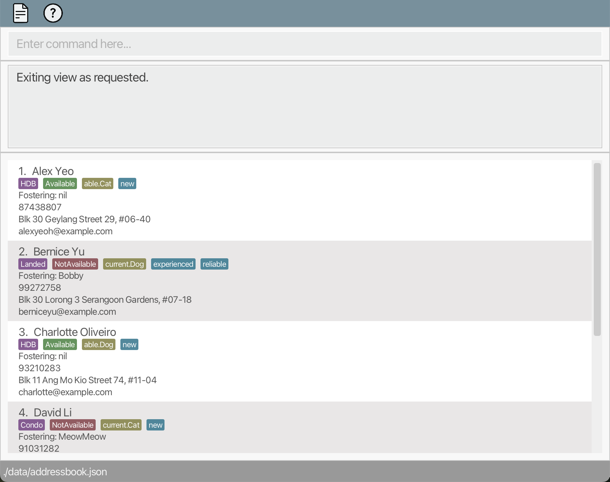

 

**2. Changes are not saved**

Let's say you did not save your changes and entered <code>exit</code>. 

 

If you press Enter again, your changes are discarded and you are led back to the main window.
If you press Esc key, the exit is cancelled and you can continue working on the profile page.

 

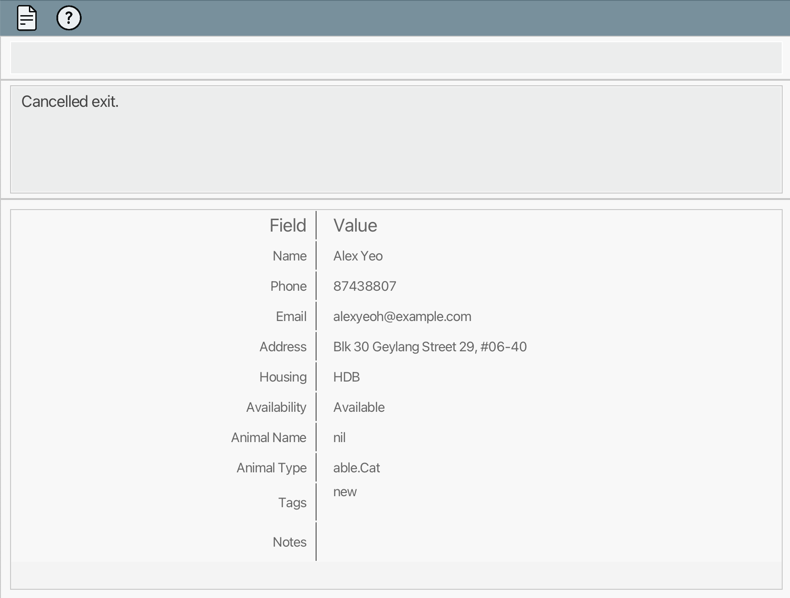

The example above is the result of pressing the Esc key after you are warned.

To learn more about **adding a new fosterer through the profile page**, refer to the section [Adding a fosterer through the profile page: add](#adding-a-fosterer-through-the-profile-page-add).  
To learn more about **editing a fosterer through the profile page**, refer to the section [Editing a fosterer's detail through the profile page: edit](#editing-a-fosterers-detail-through-the-profile-page-edit).

 

## Features

**:information_source: Notes about the command format:** 

* Words in `UPPER_CASE` are  parameters to be supplied by you. 
  e.g. in `n/NAME`, `NAME` is a parameter which can be used as `add n/John Doe`.

* Items in square brackets are optional. 
  e.g `n/NAME [t/TAG]` can be used as `n/John Doe t/urgent` or as `n/John Doe`.

* Items with `…`​ after them can be used multiple times, _**including zero times**_. 
  e.g. `[t/TAG]…​` can be used as ` ` (i.e. zero times), `t/friend`, `t/friend t/family` etc.

* Parameters can be in any order. 
  e.g. if the command specifies `n/NAME p/PHONE_NUMBER`, `p/PHONE_NUMBER n/NAME` is also acceptable.

* Extraneous parameters for commands that do not take in parameters (such as `help`, `exit` and `reset`) will be ignored. 
  e.g. if the command specifies `help 123`, it will be interpreted as `help`.

* If you are using a PDF version of this document, be careful when copying and pasting commands that span multiple lines, as space characters surrounding line-breaks may be omitted when copied over to the application.

  

### Viewing Help for Commands : `help`

Opens a pop-up window, providing you with the link to our User Guide for help.

Format: `help`

  

### Adding a fosterer through the main window: `add`

Adds a fosterer to your address book, done through the main window.

Format: `add n/NAME p/PHONE_NUMBER e/EMAIL a/ADDRESS housing/HOUSING_TYPE availability/AVAILABILITY animal/ANIMAL_NAME animalType/TYPE_OF_ANIMAL [t/TAG]…`

Parameters:

| Parameter        | About                                                                                                                                                                                                                                                                       | Example                                                     |
|------------------|-----------------------------------------------------------------------------------------------------------------------------------------------------------------------------------------------------------------------------------------------------------------------------|-------------------------------------------------------------|
| `NAME`           | Name of the fosterer                                                                                                                                                                                                                                                        | `Alice Tan`, `Harry Yeo`                                    |
| `PHONE_NUMBER`   | Phone number of the fosterer                                                                                                                                                                                                                                                | `93456778`, `89067547`                                      |
| `EMAIL`          | Email of the fosterer                                                                                                                                                                                                                                                       | `thomas718@gmail.com`, `kate@yahoo.com.sg`                  |
| `ADDRESS`        | Address of the fosterer                                                                                                                                                                                                                                                     | `Orchard road, Blk 8, #13-04`                               |
| `HOUSING_TYPE`   | - Housing type of the fosterer  - Case-sensitive  - Can be HDB / Condo / Landed / nil                                                                                                                                                                               | `HDB`, `Condo`, `Landed`, `nil`                             |
| `AVAILABILITY`   | - Availability of the fosterer  - Case-sensitive  - Can be Available / NotAvailable / nil                                                                                                                                                                           | `NotAvailable`, `Available`, `nil`                          |
| `ANIMAL_NAME`    | - If `availability/NotAvailable`: Name of the animal fostered  - If `availability/Available`: nil  - If `availability/nil`: nil                                                                                                                                     | `Fluffball`, `nil`                                          |
| `TYPE_OF_ANIMAL` | - Type of animal which the fosterer is currently fostering, or prefer to foster  - Case-sensitive  - If `availability/NotAvailable`: current.Dog / current.Cat / nil  - If `availability/Available`: able.Dog / able.Cat / nil  - If `availability/nil`: nil | `current.Dog`, `current.Cat`, `able.Dog`, `able.Cat`, `nil` |
| `TAG`            | Tag to be associated with the fosterer                                                                                                                                                                                                                                      | `experienced`, `urgent`                                     |

**:bulb: Tip:** 

* A person can have any number of tags (including 0).
* `nil` can be indicated for `HOUSING_TYPE`, `AVAILABILITY`, `ANIMAL_NAME` and `TYPE_OF_ANIMAL` if that specific information is not currently available.

Valid cases:

| No. | Scenario                                                    | `AVAILABILITY` | `ANIMAL_TYPE`     | `ANIMAL_NAME` |
|-----|-------------------------------------------------------------|-------------|-------------------|---------------|
| 1   | Not fostering, insufficient info collected                  | `nil`         | `nil`             | `nil`         |
| 2   | Not fostering, insufficient info collected                  | `Available`   | `nil`             | `nil`         |
| 3   | Not fostering, preference indicated                         | `Available`   | `able.Dog/Cat`    | `nil`         |
| 4   | Not fostering (e.g. overseas, currently not able to foster) | `NotAvailable`            | `nil`             | `nil`         |
| 5   | Fostering: ALL information must be present                  | `NotAvailable`            | `current.Dog/Cat` | NOT `nil`          |

* For invalid cases, error messages will be shown when the invalid command is entered. For example:
  

**:exclamation: Important:** 

You cannot add duplicate fosterers. This is detected using the fosterer's name. 
e.g. <code>"Anne Tay"</code> is the same person as <code>"anne tay"</code> and <code>"anne  (multiple spaces)  tay"</code>.

 

Examples:
* `add n/Jerry Tan p/98765412 e/jerry123@example.com a/Baker street, block 5, #27-01 housing/HDB availability/NotAvailable animal/Dexter animalType/current.Cat t/Urgent`
  * adds a fosterer named Jerry Tan with the phone number 98765412 and email address jerry123@example.com; his address is Baker street, block 5, #27-01, housing type is HDB and he is fostering a cat named Dexter. An urgent visit is required.
* `add n/Tom Lee p/98123456 e/tom@example.com a/Happy street, block 123, #01-01 t/Available t/HDB t/able.Dog`
  * adds a fosterer named Pete Tay with the phone number 98765411 and email address pete@example.com; his address is Happy street, block 5, #01-01, housing type is Condo and currently he is not fostering any animal but looking to foster a cat.

In the case where duplicates field descriptions are given, the last one will be chosen:
* `add n/Jerry Tan p/98765412 e/jerry123@example.com a/Baker street, block 5, #27-01 housing/HDB housing/Condo availability/Available availability/NotAvailable animal/Dexter animal/Happy animalType/able.Dog animalType/current.Cat t/Urgent`
  * adds a fosterer named Jerry Tan with the phone number 98765412 and email address jerry123@example.com; his address is Baker street, block 5, #27-01, housing type is Condo and he is fostering a cat named Dexter. An urgent visit is required.

### Adding a fosterer through the profile page: `add`

Brings you to an empty profile page with the fields set to `nil`. You can key in the fosterer's details and save the 
information, which then adds the fosterer to your address book.

Format: `add`

**:information_source: Notes about the command:** 

*  The restrictions imposed on what makes a valid fosterer, as explained in the section [Adding a fosterer through the main window: add](#adding-a-fosterer-through-the-main-window-add), still applies in this alternative way of adding a fosterer.

Here is the profile page you can see after entering <code>add</code>: 

To learn more about the profile page, please refer to the section [User Interface: The Profile Page](#the-profile-page).  

  

### Listing fosterers: `list` (Alias: `find`)

Lists fosterers in your address book that match a particular description or search, or all fosterers if the search is blank.

Format: `list *KEYWORDS`

Alias: `find`

**:information_source: Notes about the command:** 

* The keywords are case-insensitive.

* The order of the keywords does not matter. e.g. `Hans Bo` will match `Bo Hans`.

* All fields are searched (including tags).

* Keywords can match as parts of words. e.g. `john` will match `Johnny`.
* Keywords can overlap. e.g. `samm my` will match `Sammy`.

* Fosterers must match all keywords (i.e. `AND` search). 
  e.g. `Hans Bo` will return `Hansbo Grahm`, but not `Hans Duo`.

* Use double quotes `"` for exact, case-sensitive, word-level match. 
  e.g. `"Tom"` matches "Tom", but not "Tommy".

* Symbols between keywords or sections will combine them according to the function of the symbol. 

| Symbol / Operator | Description              | Precedence |
|-------------------|--------------------------|------------|
| `&`               | Logical AND              | lowest     |
| `/`               | Logical OR               | low        |
| `' '` (space)     | Logical AND              | high       |
| `(` and `)`       | Parentheses for grouping | highest    |

e.g. `a & b / c d` is the same as `a & (b / (c & d))`.

Examples:
* `list`
    * lists all fosterers in the address book.
* `list john doe`
    * lists entries which match "John Doe", "Doe John", "Johnny Doe", and "Mary" who lives on "John Doe Street".
* `find john john doe`
    * is redundant and gives the same result as `find john doe`.
* `list "John" / zam & doe`
    * lists entries which match "John Doe" and "Doe Shazam", but not "John Grahm".

  

### Viewing a fosterer's detail: `view`

Opens the profile page of the index-th fosterer in your currently displayed list.

Format: `view INDEX`

Parameters:

| Parameter | About                                                                                                                                                                | Example |
|-----------|----------------------------------------------------------------------------------------------------------------------------------------------------------------------|---------|
| `INDEX`     | - Index of a fosterer displayed in the list obtained from a `list`/`find` command   - Index must be a positive integer | `1`, `2`, `3` |

**:exclamation: Important:** 

Only specific commands are available to you in the profile page. 
The list of available commands are <code>help</code>, <code>save</code>, and <code>exit</code>. 

 

Examples:
* `list` followed by `view 2`
  * views the profile of the 2nd fosterer in the address book.

To learn more about profile page, please refer to the section [User Interface: the Profile View](#the-profile-view). 

  

#### Editing a fosterer’s details in profile page:

Here is a step-by-step explanation of how you can edit a fosterer's details in profile page. 

1. Enter a fosterer’s profile page with `view INDEX`. e.g. `view 1`.

 

2. Type in the name of the field you want to edit onto the command box. This will make the textbox visible next to the field and automatically set the text cursor to the textbox. e.g. Enter 'name'.

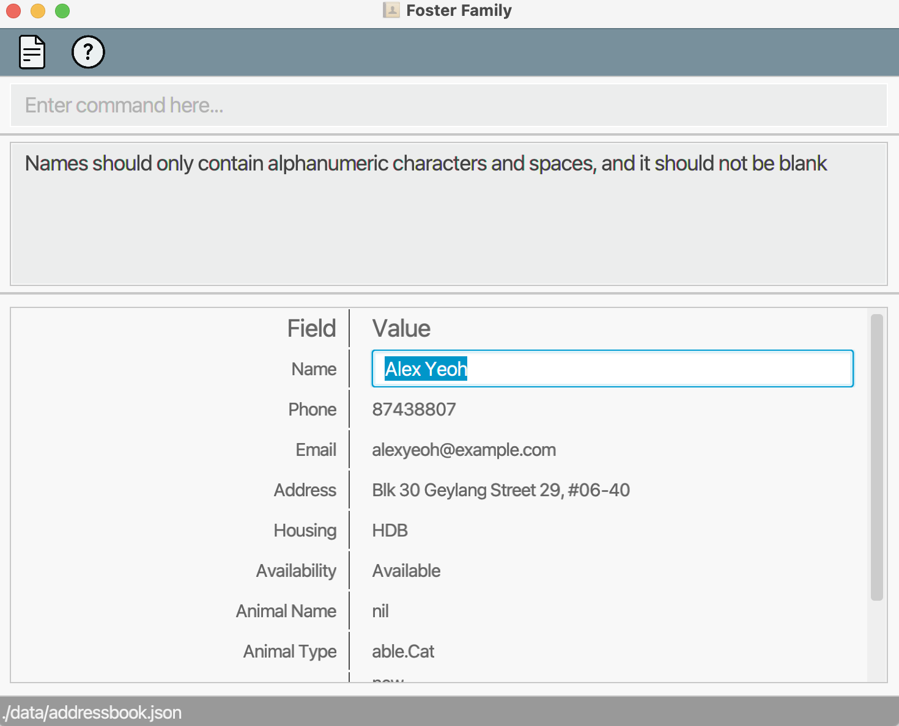

 

3. Edit the original value to a new value. e.g. From Alex Yeoh to 'Bob Yeoh'.

 

4. Press Enter to return the text cursor back to the command box. This makes the textbox disappear. 

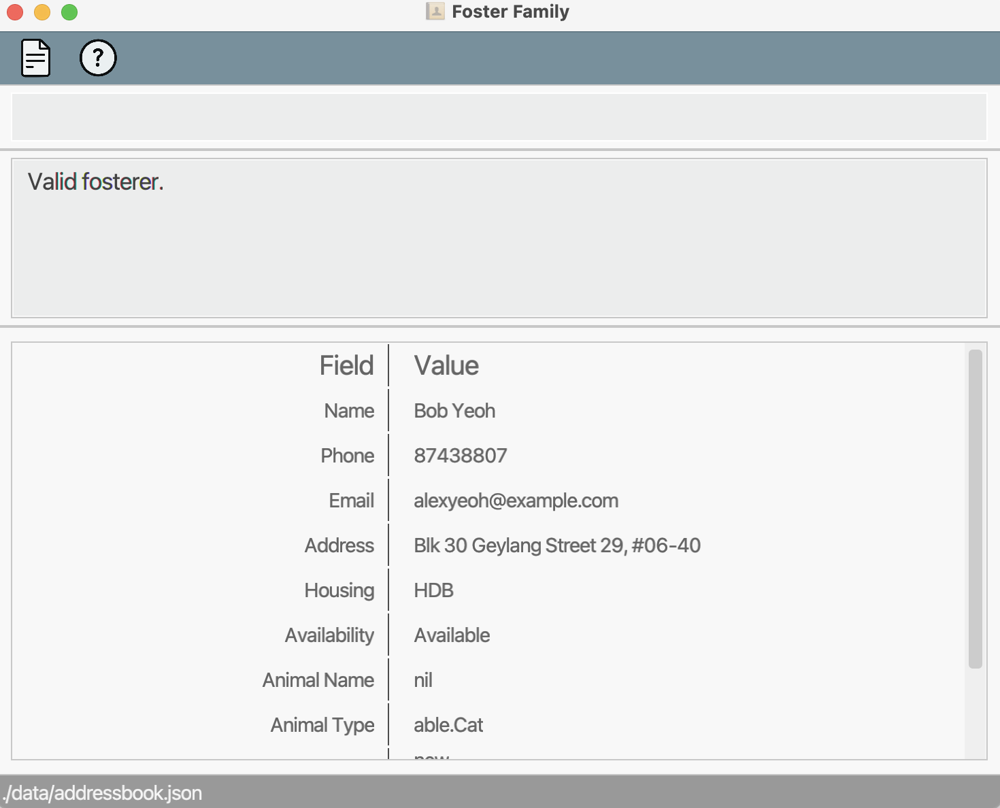

 

5. Type in `save` command and Enter to save the changes of the fosterer. 

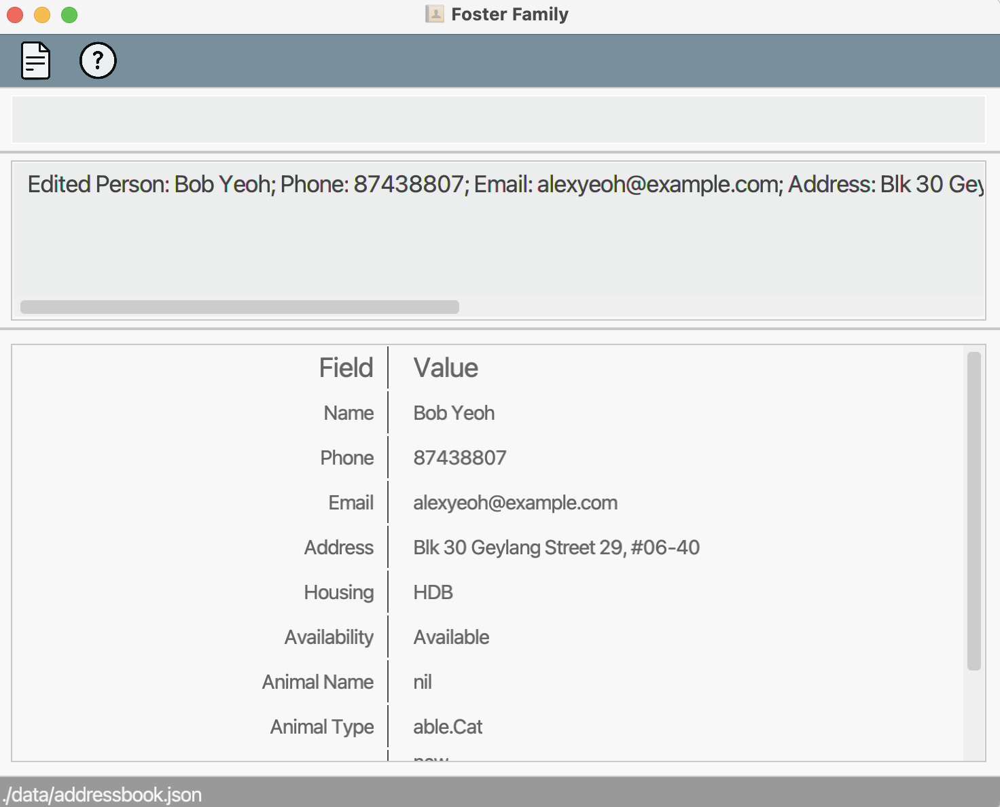

  

### Saving changes in a fosterer's details: `save`

Saves changes in details of the fosterer made in the profile page.

**:exclamation: Important:** 

This command is only available while in fosterer profile page.
This command works only in a profile page, which appears after executing a view command.

Format: `save`

**:information_source: Notes about the command:** 

*  Entering <code>save</code> in [the profile of a new fosterer](#adding-a-fosterer-through-the-profile-page-add) saves the new fosterer and exits the profile page.
*  Entering <code>save</code> in [the profile of an already existing fosterer](#editing-a-fosterers-detail-through-the-profile-page-edit) saves the changes but does not exit the profile page, in case you want to edit more details. 

Here is the result of entering <code>save</code> a new fosterer name John: 

As you can see, entering <code>save</code> for a new fosterer exits the profile page. 

 

Here is the result of entering <code>save</code> after changing the name from John to John Kim: 

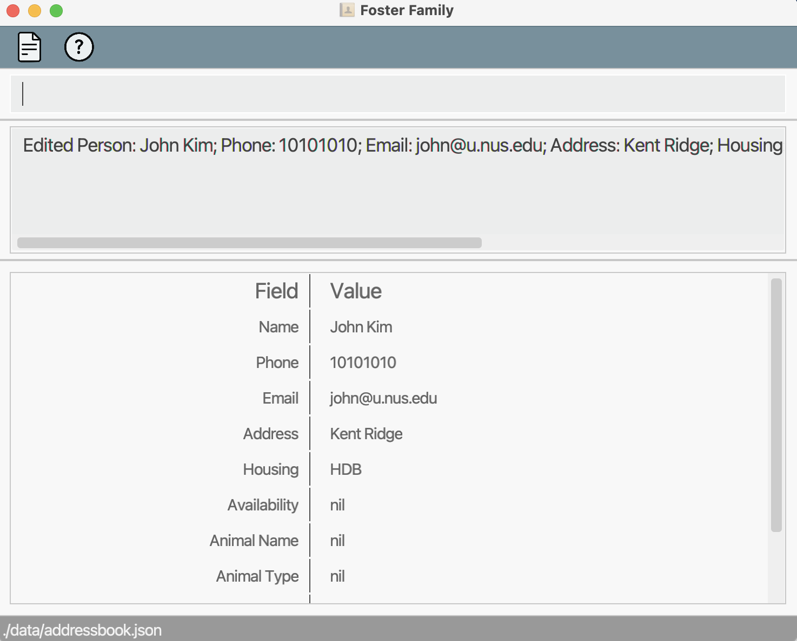

As you can see, entering <code>save</code> for an already existing fosterer does not exit the profile page. 

  

### Editing a fosterer's detail through the main window: `edit`

Edits the details of the index-th fosterer in your currently displayed list, done through the main window.

Format: `edit INDEX [n/NAME] [p/PHONE_NUMBER] [e/EMAIL] [a/ADDRESS] [housing/HOUSING_TYPE] [availability/AVAILABILITY] [animal/ANIMAL_NAME] [animalType/TYPE_OF_ANIMAL] [t/TAG…]`

Parameters:

| Parameter        | About                                                                                                                                                                                                                                                                               | Example                                                     |
|------------------|-------------------------------------------------------------------------------------------------------------------------------------------------------------------------------------------------------------------------------------------------------------------------------------|-------------------------------------------------------------|
| `INDEX`     | - The index of a fosterer displayed in the list obtained from a `list`/`find` command   - At least one index must be provided  - Index must be a positive integer | `1`, `2`, `3` |
| `NAME`           | Updated name of the fosterer                                                                                                                                                                                                                                                        | `Alice Tan`, `Harry Yeo`                                    |
| `PHONE_NUMBER`   | Updated Phone number of the fosterer                                                                                                                                                                                                                                                | `93456778`, `89067547`                                      |
| `EMAIL`          | Updated email of the fosterer                                                                                                                                                                                                                                                       | `thomas718@gmail.com`, `kate@yahoo.com.sg`                  |
| `ADDRESS`        | Updated address of the fosterer                                                                                                                                                                                                                                                     | `Orchard road, Blk 8, #13-04`                               |
| `HOUSING_TYPE`   | - Updated housing type of the fosterer  - Case-sensitive  - Can be HDB / Condo / Landed / nil                                                                                                                                                                               | `HDB`, `Condo`, `Landed`, `nil`                             |
| `AVAILABILITY`   | - Updated availability of the fosterer  - Case-sensitive  - Can be Available / NotAvailable / nil                                                                                                                                                                           | `NotAvailable`, `Available`, `nil`                          |
| `ANIMAL_NAME`    | - If `availability/NotAvailable`: Updated name of animal fostered  - If `availability/Available`: nil  - If `availability/nil`: nil                                                                                                                                         | `Fluffball`, `nil`                                          |
| `TYPE_OF_ANIMAL` | - Updated type of animal which the fosterer is currently fostering, or prefer to foster  - Case-sensitive  - If `availability/NotAvailable`: current.Dog / current.Cat / nil  - If `availability/Available`: able.Dog / able.Cat / nil  - If `availability/nil`: nil | `current.Dog`, `current.Cat`, `able.Dog`, `able.Cat`, `nil` |
| `TAG`            | Tag to be associated with the fosterer                                                                                                                                                                                                                                      | `experienced`, `urgent`                                     |

**:bulb: Tip:** 

* The index of the fosterer has to be provided, however the number of parameters to be edited can vary from zero to all fields.

**:exclamation: Important:** 

If the parameters are not provided, <b><code>edit INDEX</code> operates the same way as <code>view INDEX</code></b>, leading you to the profile page of the person at index <code>INDEX</code> in the addressbook. 

Examples:
*  `find` or `list` followed by `edit 3 n/John` 
   * edits the name of the 3rd fosterer in the address book to John.
*  `find` or `list` followed by `edit 1 p/12345678 animal/Bob` 
   * edits the phone number and the pet name of the 1st fosterer in the address book to 12345678 and Bob respectively.
*  `find` or `list` followed by `edit 2` 
   * changes the view to the profile page of the 2nd fosterer in the address book since parameters are not provided.

**:warning: Caution:** 

Edit may cause information loss. 
Before you type the save command, make sure there is no accidental overwrite with faulty information. 

 

### Editing a fosterer's detail through the profile page: `edit`

Edits the details of the index-th fosterer in your currently displayed list, done through the profile page.

Format: `edit INDEX`

Parameters:

| Parameter | About                                                                                                                                                                    | Example |
|-----------|--------------------------------------------------------------------------------------------------------------------------------------------------------------------------|---------|
| `INDEX`     | - The index of a fosterer displayed in the list obtained from a `list`/`find` command   - Index must be a positive integer | `1`, `2`, `3` |

**:information_source: Notes about the command:** 

* Apart from the details added by the add command, we also provide an optional **notes feature** in the profile page for 
more flexibility.
* You can use this to include additional details(non-exhaustive) such as: 
  * Health condition of the animal
  * Foster period of the animal
  * Identifiable physical traits of the animal
*  Just like the other fields, remember to save the changes using the `save` command.
  * Please refer to the section [Viewing a fosterer's detail: Editing a fosterer’s details in profile page](#editing-a-fosterers-details-in-profile-page) for the specific steps on how to edit a fosterer in their 
profile page.
 

**:warning: Caution:** 
Edit may cause information loss. 
Before you type the save command, make sure there is no accidental overwrite with faulty information. 

 

Here is an example of entering <code>view 1</code> to view a fosterer name Benson Meie who is currently at index 1:

To learn more about the profile page, please refer to the section [User Interface: The Profile Page](#the-profile-page). 

  

### Deleting a fosterer : `delete`

Deletes the index-th fosterer in your currently displayed list.

Format: `delete INDEX [INDEX...]`

**:exclamation: Important:** 
The index of a fosterer is not fixed. It is relative to the current list of fosterers you are handling.

Parameters:

| Parameter | About                                                                                                                                                                     | Example |
|-----------|---------------------------------------------------------------------------------------------------------------------------------------------------------------------------|---------|
| `INDEX`     | - The index of a fosterer displayed in the list obtained from a `list`/`find` command   - At least one index must be provided  - Index must be a positive integer | `1`, `2`, `3` |

**bulb: Tip:** 
You can delete multiple fosterers at once.  

* Each index needs to be separated by a white space.  

* Any duplicates and extra white spaces will be ignored.

Examples:
* `list` followed by `delete 2` 
  * deletes the 2nd fosterer in the address book.
* `find Jerry` or `list Jerry`, followed by `delete 1`
  * deletes the 1st fosterer in the result list.
* `list` followed by `delete 1 3 7` 
  * deletes the 1st, 3rd and 7th fosterers in the address book.
    

* `list` followed by `delete 3 3 3 3` 
  * deletes the 3rd fosterer in the address book.

  

### Sorting fosterers: `sort`

Sorts your list of fosterers alphabetically, by name.

Format: `sort`

  

### Viewing Statistics of Available Fosterers : `stats avail`

Helps you calculate statistics about fosterers who are available to foster, and the animals they can foster. Percentages are calculated to 2 decimal places.

Format: `stats avail`

**:information_source: Notes about the command:** 

All statistic commands are calculated based on your currently displayed list. 
If you enter `find available` before `stats avail`, the resulting statistic will show that all listed fosterers are available. Hence, please ensure that the current list is the list you want your statistics to be calculated from. 

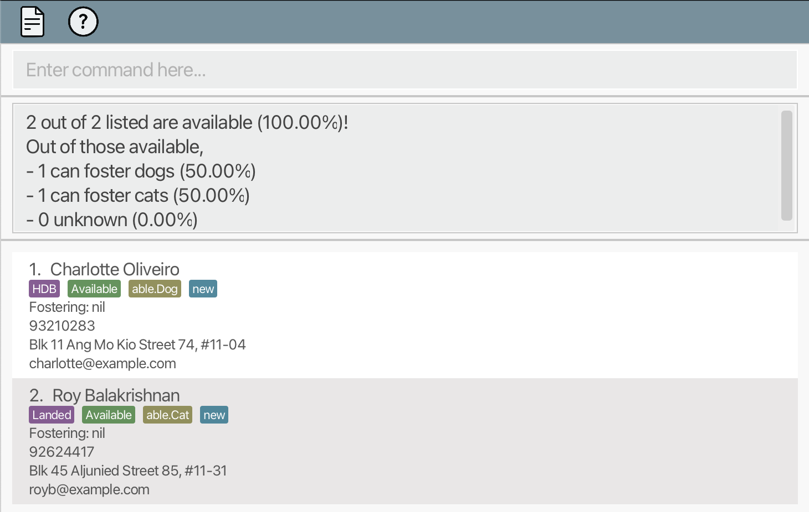

Examples:
* `list` followed by `stats avail` 
  * calculates statistics of available fosterers, based on all fosterers in the address book.
    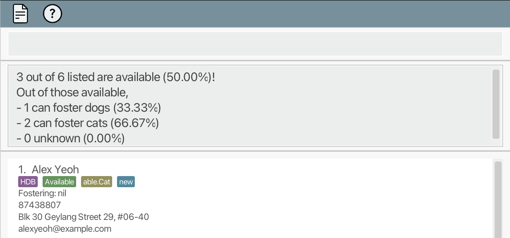

* `find cat` followed by `stats avail` 
  * calculates statistics of available fosterers, based on fosterers who are either currently fostering a cat or are able to foster a cat.

**:warning: Caution:** 

Percentages may not add up to 100.00%. 
Suppose you have 3 available fosterers: 1 can foster a dog, 1 can foster a cat and 1 unknown. The calculated percentages will add up to 99.99%, instead of 100.00%. It can be assumed that each group takes up 1/3 out of 100.00%.

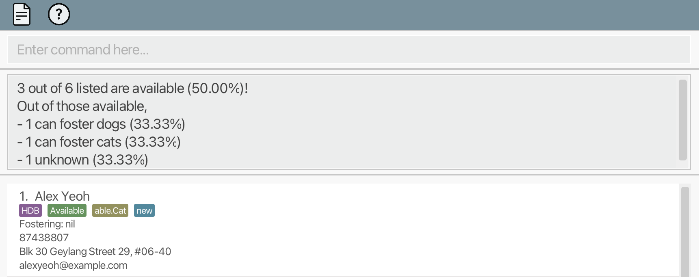

  

### Viewing Statistics of Current Fosterers : `stats current`
Helps you calculate statistics about fosterers who are currently fostering, and the type of animals they are fostering. Percentages are calculated to 2 decimal places.

Format: `stats current`

Examples:
* `list` followed by `stats current` 
  * calculates statistics of current fosterers, based on all fosterers in the address book.
  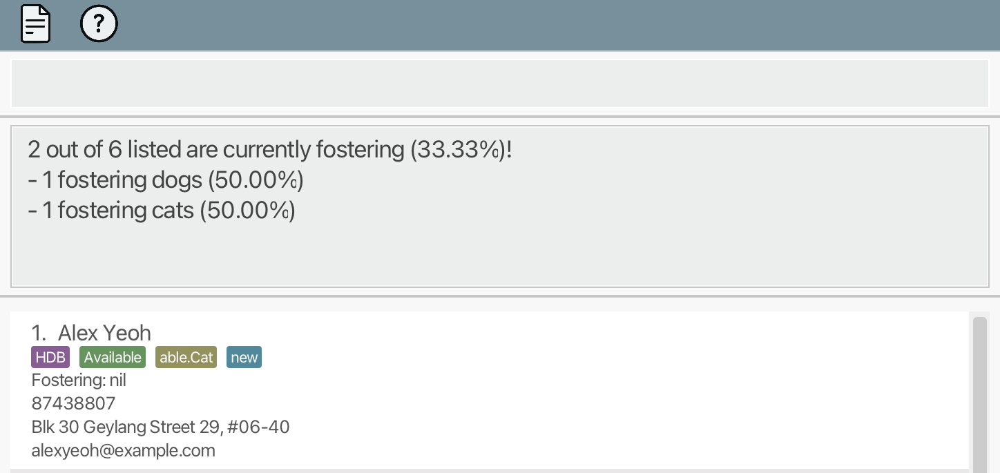

* `find dog` followed by `stats current`
  * calculates statistics of current fosterers, based on fosterers who are either currently fostering a dog,  or are able to foster a dog.

  

### Viewing Housing Statistics : `stats housing`
Helps you calculate statistics about the various housing types of fosterers. Percentages are calculated to 2 decimal places.

Format: `stats housing`

Examples:
* `list` followed by `stats housing`
  * calculates housing statistics based on all fosterers in the address book.
    

* `find available` followed by `stats housing` 
  * calculates housing statistics based on fosterers who are available.

  

### Undoing the previous command : `undo`

Undoes your previous command, given that the previous command successfully executed is either `add`, `delete`, or `edit`.

Format: `undo`

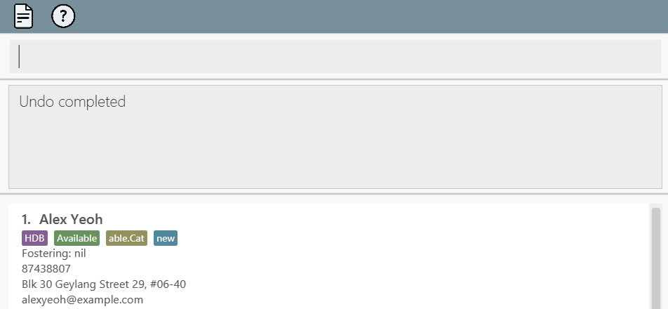

**:information_source: Notes about the command:** 

*  The `undo` command can only be executed **once** at a time, and it will undo your last successful command. When the `undo` command is executed consecutively more than once, an error message will be shown:

  

### Clearing all entries : `reset`, followed by `reset confirm`

Clears all your entries from the address book.

Format: `reset`, followed by `reset confirm`

**:information_source: Notes about the command:** 

*  Upon entering `reset`, a confirmation message will be shown for the user to verify if he/she really wants to clear all the data entries.

   * User is prompted to enter `reset confirm` to confirm and execute the deletion of all data entries.

   * In the case where the user wishes to cancel the reset, he/she just has to proceed and type any other command in the command box.

  

### Exiting the program : `exit`

Exits the program.

Format: `exit`

**:information_source: Notes about the command:** 

* On the profile page, entering <code>exit</code> leads you out of the page back to the main window. 
* On the profile page, attempting to <code>exit</code> without saving changes with <code>save</code> prompts a warning message (refer to [User Interface: The Profile Page: Exiting the profile page](#exiting-the-profile-page)). 

  

### Saving data

In the main window, your Foster Family data is saved in the hard disk automatically after any command that changes the data, so no manual saving is needed. However, edits made in the profile page have to be saved via the `save` command. Else, changes will be discarded once you exit out of that fosterer's profile page.

  

### Editing data file

Your Foster Family data is saved automatically as a JSON file `[JAR file location]/data/addressbook.json`. We strongly
advise you to update the data file directly only if you are an advanced user. Otherwise, we highly recommend you to perform 
edits using our user-friendly interface instead.

**:warning: Caution:** 
* If your changes to the data file makes its format invalid, Foster Family will discard all data and start with an empty data file at the next run. Hence, it is recommended to make a backup of the file before editing it. 

* If your changes create an [invalid fosterer](#adding-a-fosterer-through-the-main-window--add), the app will not start. You will have to rectify the error in order to restart the app. 

--------------------------------------------------------------------------------------------------------------------
## FAQ

**Q**: How do I transfer my data to another Computer? 
**A**: Install the app in the other computer, and overwrite the empty data file it creates with the file that contains the data of your previous Foster Family home folder.

--------------------------------------------------------------------------------------------------------------------

## Known issues

1. **When using multiple screens**, if you move the application to a secondary screen, and later switch to using only the primary screen, the GUI will open off-screen. The solution is to delete the `preferences.json` file created by the application before running the application again.

--------------------------------------------------------------------------------------------------------------------

## Command summary

| Action                                   | Format                                                                                                                                                                    | Examples                                                                                                                                                                |
|------------------------------------------|---------------------------------------------------------------------------------------------------------------------------------------------------------------------------|-------------------------------------------------------------------------------------------------------------------------------------------------------------------------|
| **Help**                                 | `help`                                                                                                                                                                    | -                                                                                                                                                                       |
| **Add** from main window                 | `add n/NAME p/PHONE_NUMBER e/EMAIL a/ADDRESS housing/HOUSING_TYPE availability/AVAILABILITY animal/ANIMAL_NAME animalType/TYPE_OF_ANIMAL [t/TAG]…`                        | `add n/Jerry Tan p/98765412 e/jerry123@example.com a/Baker street, block 5, #27-01 housing/HDB availability/NotAvailable animal/Dexter animalType/current.Cat t/Urgent` |
| **Add** from profile page                | `add`                                                                                                                                                                     | -                                                                                                                                                                       |
| **List**  or **Find**                    | `list`, `find`                                                                                                                                                            | `list`, `find`,  `list available`, `find available`                                                                                                                     |
| **View Profile**                         | `view INDEX`                                                                                                                                                              | `view 1`                                                                                                                                                                |
| **Save updated fosterer details**        | `save`                                                                                                                                                                    | -                                                                                                                                                                       |
| **Edit** from main window                | `edit INDEX [n/NAME] [p/PHONE_NUMBER] [e/EMAIL] [a/ADDRESS] [housing/HOUSING_TYPE] [availability/AVAILABILITY] [animal/ANIMAL_NAME] [animalType/TYPE_OF_ANIMAL] [t/TAG…]` | `edit 2 n/James Lee e/jameslee@example.com`                                                                                                                             |
| **Edit** from profile page               | `edit INDEX`                                                                                                                                                              | `edit 1`                                                                                                                                                                |
| **Delete**                               | `delete INDEX [INDEX...]`                                                                                                                                                 | `delete 1 2 3`                                                                                                                                                          |
| **Sort**                                 | `sort`                                                                                                                                                                    | -                                                                                                                                                                       |
| **View Available Fosterer Statistics**   | `stats avail`                                                                                                                                                             | -                                                                                                                                                                       |
| **View Current Fosterer Statistics**     | `stats current`                                                                                                                                                           | -                                                                                                                                                                       |
| **View Housing Statistics**              | `stats housing`                                                                                                                                                           | -                                                                                                                                                                       |
| **Undo**                                 | `undo`                                                                                                                                                                    | -                                                                                                                                                                       |
| **Reset**                                | `reset`, followed by `reset confirm`                                                                                                                                      | -                                                                                                                                                                       |
| **Exit** from application / profile page | `exit`                                                                                                                                                                    | -                                                                                                                                                                       |
